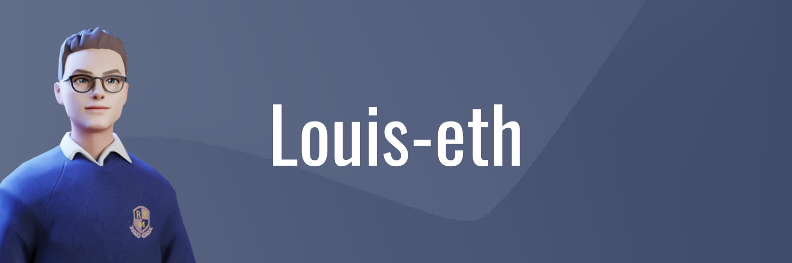

# Hello, my name is Louis,

I am a French student and I want to become a computer engineer.

_Interested in :_
* 🐦 Cross-platform software development
* ⛏ Blockchain
* 💂 Cyber security
* ⚙️ Embedded system

_Currently working on:_
 * 🐣 Learning Flutter

I propose two "kinds" of repositories :
* 🎯 Projects (e.g. complete software)
* 🧩 Tools (piece of code to add in your project)

---

<!--[][C]-->

_Languages and tools I use :_

[][C]

[][python]

[][solus]

[][vscode]

[][raspberry]

[][notion]

[][figma]

<br>
<br>
<br>

_Languages I would like to learn in 2022 :_

[][flutter]


[][Solidity]

<br>
<br>
<br>

_Career path :_

- BIA (Introduction to aeronautics certificate) with highhonours.<br>
- Eirlingua English Certification 50h.<br>
- Level B1 in written expression in German certified by <br>Deutsches Sprachdiplom der Kultusministerkonferenz. <br>
- Certificate voltaire with highest honour.
- Participation in the hackasprint on artificial intelligence.
- Certification C openclassroom (40h).

<br>

----

_Coding stats :_

<!--START_SECTION:waka-->
```text
Dart   1 hr 19 mins    █████████████████████████   100.00 % 
```
<!--END_SECTION:waka-->

<br>
<br>

<p align="center">

</p>

[C]: https://devdocs.io/c/
[python]: https://www.python.org/

[solus]: https://getsol.us/home/
[i3wm]: https://i3wm.org/
[vscode]: https://code.visualstudio.com/
[alacritty]: https://github.com/alacritty/alacritty
[git]: https://git-scm.com/

[raspberry]: https://www.raspberrypi.org/

[notion]: https://www.notion.so/
[figma]: https://www.figma.com/

[C++]: https://isocpp.org/
[flutter]: https://flutter.dev/
[Ocaml]: https://ocaml.org/index.fr.html
[Arduino]: https://www.arduino.cc/
[Solidity]: https://docs.soliditylang.org/en/v0.8.7/
